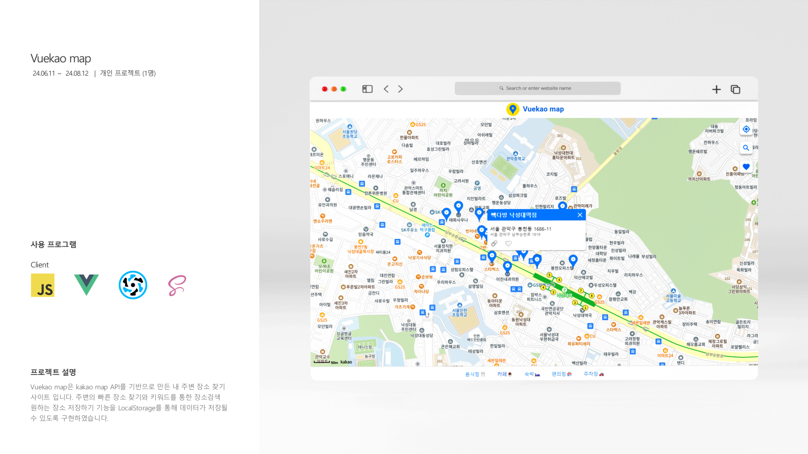
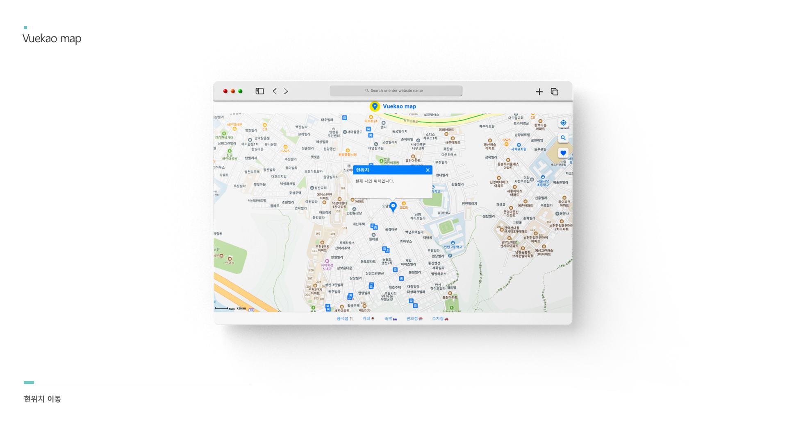
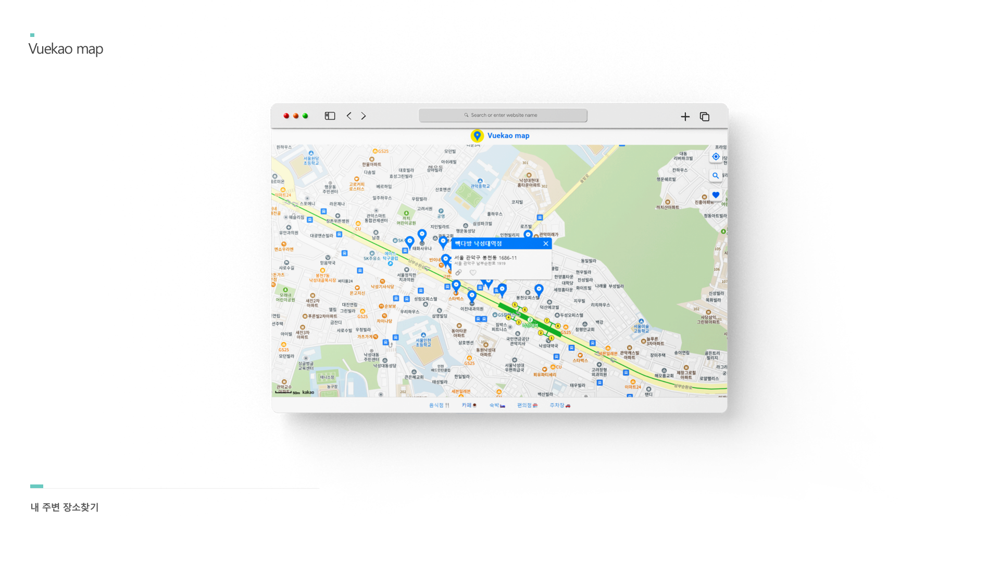
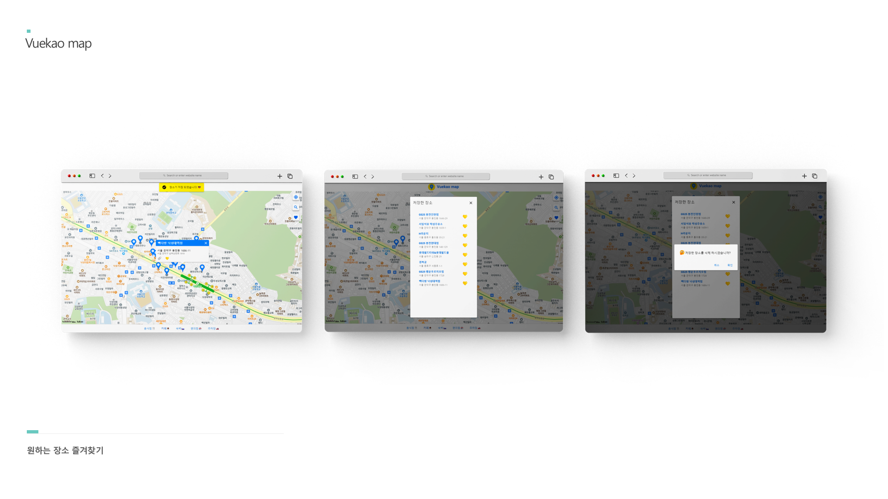
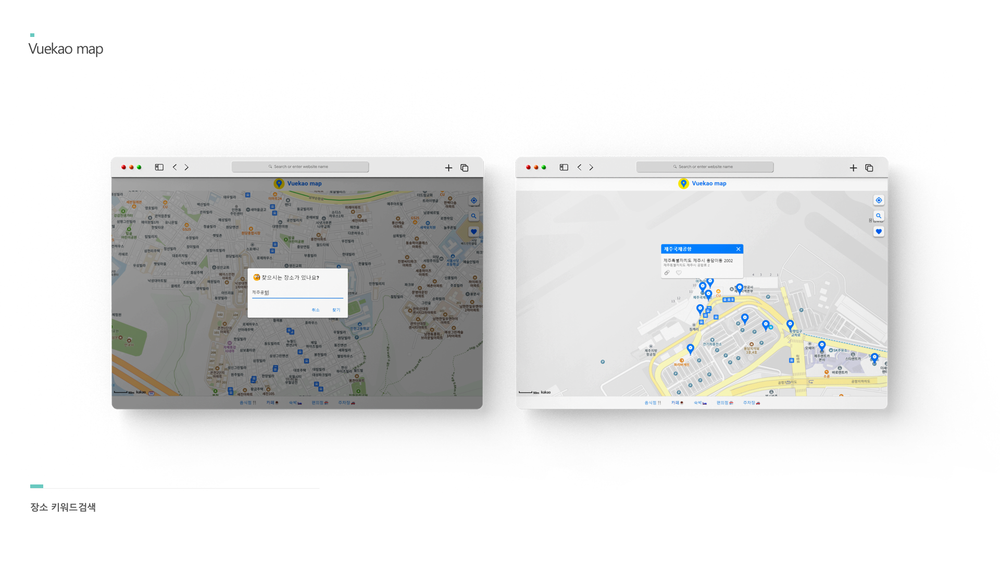

# vuekao-map

### 🔗사이트로 이동
➡️ [https://vuekao-map.netlify.app](https://vuekao-map.netlify.app/)

 

### 🛠 구현 기술
✅ Vue3 컴포넌트 기반 UI 구축 Vite를 통한 개발환경 구성

✅ Kakao Maps API를 사용한 지도기능 구현

✅ 브라우저 LocalStorage를 통한 데이터 관리

 

